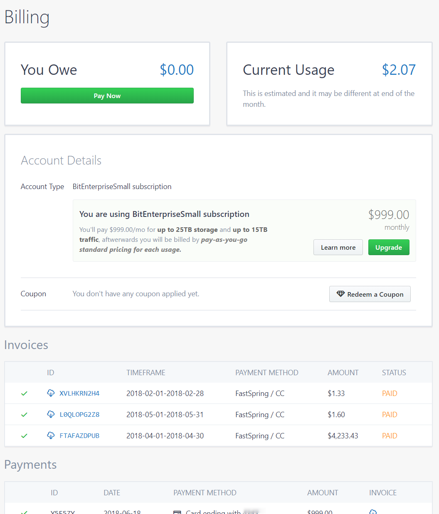
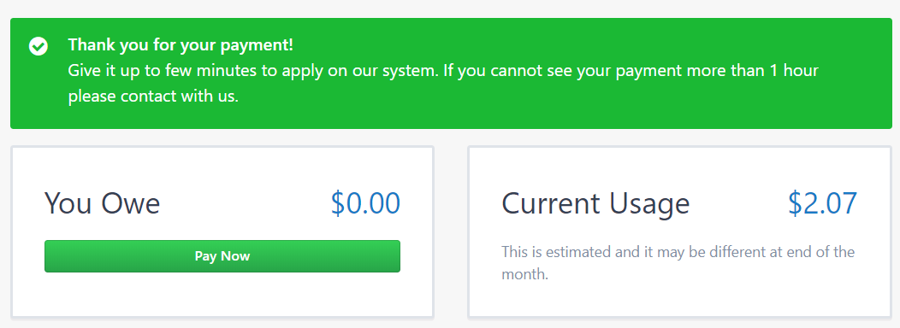

# Manage your Account
{:tools}

Visit Manage > Account > [Billing](https://www.bitpaket.com/account/billing) to see your billing details.

{:toc}

## Billing

In this page you have three sections:

* Current Balance and Owe
* Invoices
* Payments

Current Balance shows your current usage at the moment. You owe section shows invoices total amount you have to pay.

Invoices section shows your invoices and you can pay or download. Payments section is for payments made by you. Each time wi charged your Credit Card, those amounts will be listed here with proper receipt or invoice.

When you pay your invoices, you will see message box as below:

Please allow at least 1 hour for your payment listed here. In any way, you may contact with Billing Department.

### How am I billed?

We bill you based on your usages. By Requests (GET, POST...), Storage you have used so far and Transfer. You can find detailed pricings in your invoice. When we generate an invoice, we include these informations separately.

If you want to pay a fixed price, Subscriptions is fit for you.

We generate invoices on each month's first day. You pay what've you used.

> Note: If you subscribe one of our plans, then your payment date can be different instead of first day.

### How can I pay?

We accept almost all Credit Cards and Wire Transfers using FastSpring. You can pay your balances online with confidence. We do not store your card information.

> Attention! To prevent interruption, we suggest you to pay your balances by Credit Card.

## Coupons

If you have any coupon code, you can redeem it on this page. Just click **Redeem a Coupon** button and you will be prompted to enter your code. If success, you will be discounted from your first invoice.

> Attention! Any existing invoices or awaiting balances will not be discounted. Coupon code works for upcoming invoices and balances that you applied.

## Subscriptions

BitPaket uses Pay as you go model pricing. However, If you want to save money, you can subscribe one of our subscription models. Just lick **Upgrade** button and you will be listed with the details.

We also have custom pricings for enterprises. Contact with our Support for more information.
