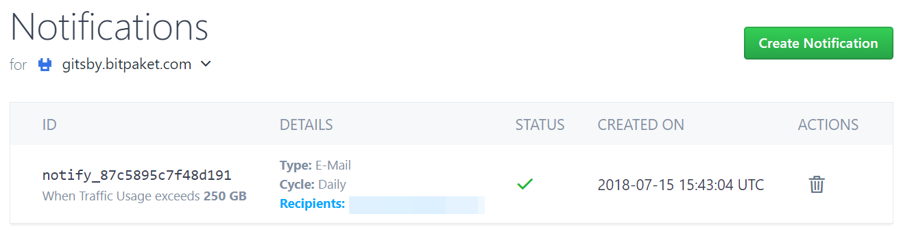
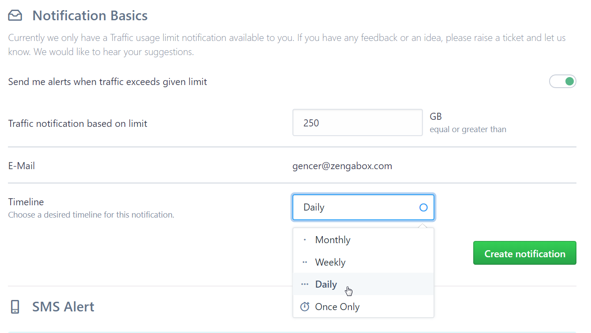

# Manage your Notifications
{:tools}

After create your very first [Paket](https://www.bitpaket.com/pakets), you can now manage your notifications by reading this article.

{:toc}

## Create and Delete Notification

Visit Manage > [Notification](https://www.bitpaket.com/paket/notification) to see your Notifications.

### Create

When you click **Create Notification** button as shown above image, you can continue to create a notification.

Let's evaluate this screen:

Give BitPaket a minimum amount of GB to be reached. When you reach this amount, we will send you notification.

#### Cycle

When you reach this amount of size, you will be notified either one time only or each *week*, *month* or *day*. You can manage this as you want.

### Delete

Open Notification list and click **Delete* (Trash) icon that you want to remove notification. You will be asked if you are sure. Make sure this is what you want. After clicking yes, Your notification will be deleted.

> **Attention!** There is no way back for this action. Please make sure that this notification is not critical.
