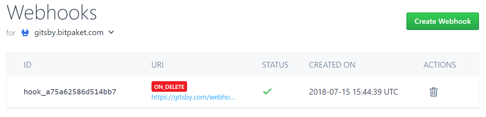
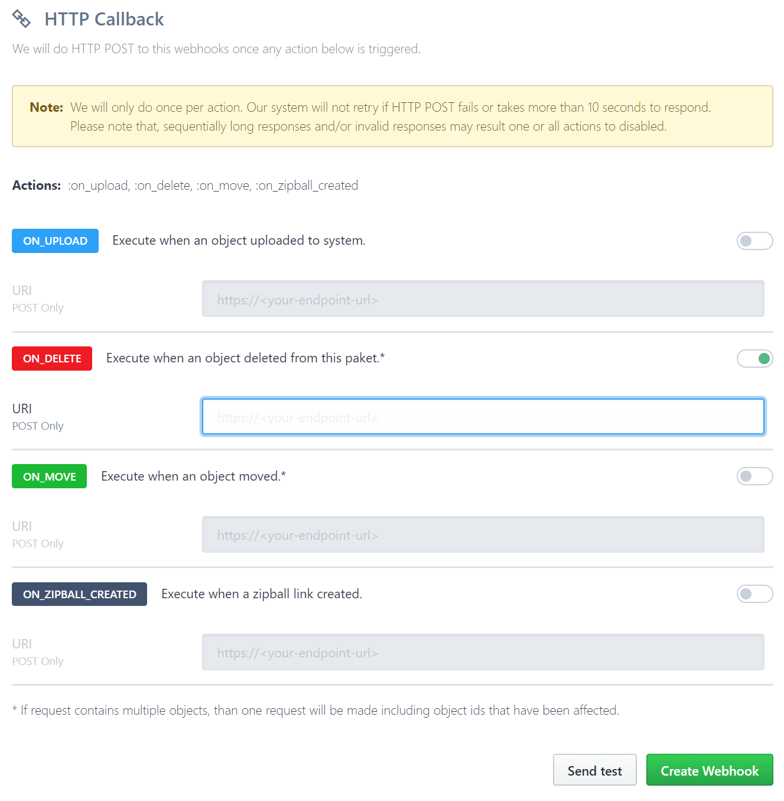

# Manage your Webhooks
{:tools}

After create your very first [Paket](https://www.bitpaket.com/pakets), you can now manage your webhooks by reading this article.

{:toc}

## Create and Delete Webhook

Visit Manage > [Webhooks](https://www.bitpaket.com/paket/webhooks) to see your Webhooks.

### Create

When you click **Create Webhook** button as shown above image, you can continue to create a Webhook.

Let's evaluate this screen:

Select which event you want to add webhook and enter your Webhook Endpoint URL. You can test this event by clicking **Sent Test** button. You can enable multiple events with same URI or different URIs. Choice is yours.

We send payload as JSON Object

> **Note:** You can also create multiple webhooks for same events with different endpoints. Just create another by clicking **Create Webhook** again.

#### URI

URIs should be unique to your event and it should accept **POST** requests. If your endpoint does not accept *POST* requests, webhook will fail.

> **Attention!** We will try failed webhooks 5 times in spare time. Afterwards we will terminate process.

### Delete

Open Webhooks list and click **Delete* (Trash) icon that you want to remove Webhook. You will be asked if you are sure. Make sure this is what you want. After clicking yes, Your Webhook will be deleted.

> **Attention!** There is no way back for this action. Please make sure that this Webhook is not critical.
