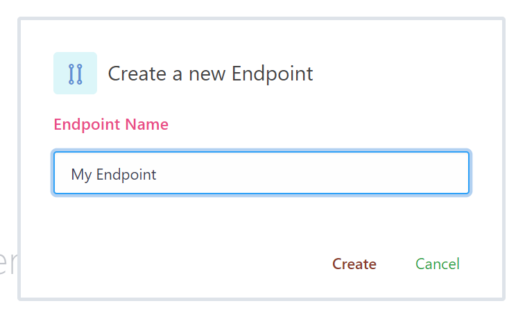

# Manage your Endpoints
{:tools}

To connect, upload objects and manage then, you need at least one working endpoint. Each endpoint can have multiple API Tokens. Those tokens can live infinitely or can have expiration date.

While you can upload objects and set specific properties on them via our Dashboard, you still need to use API Endpoints to take full control.

See your endpoints: [https://www.bitpaket.com/paket/api](https://www.bitpaket.com/paket/api)

{:toc}

## Listing your Endpoints

Visit Manage > [Endpoints](https://www.bitpaket.com/paket/api) to see your endpoints. Here, we have ID, Secret, Status and Action buttons.

* **ID:** Your Client ID
* **Secret:** Your Client Secret. This is required on critial operations.
* **Status:** Paket and Endpoint Status. If you disable your poaket, you will see this field marked as red.
* **Action:** Action buttons for endpoint. *Delete* and *Manage* Tokens.

## Creating an Endpoint

Create an endpoint by going Manage > [Endpoints](https://www.bitpaket.com/paket/api).

When **success**, you will see message:

Now, click manage .
