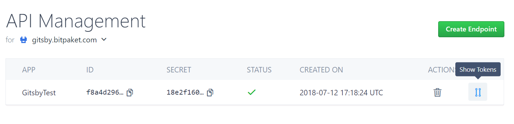
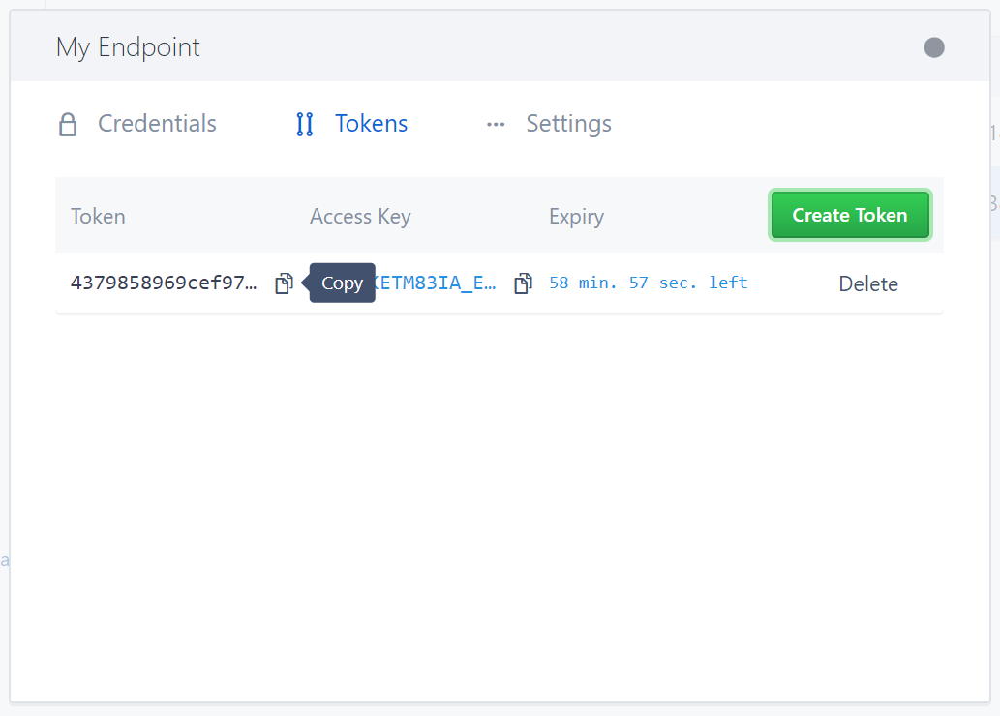
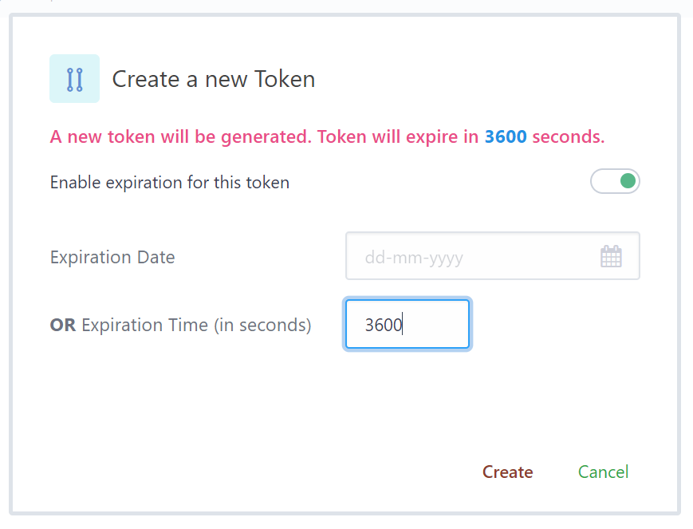
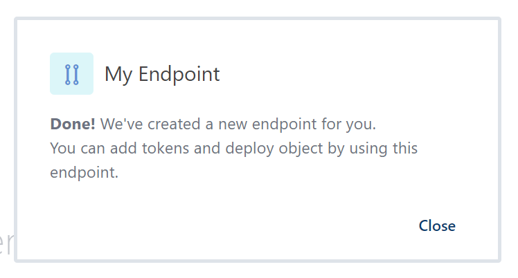
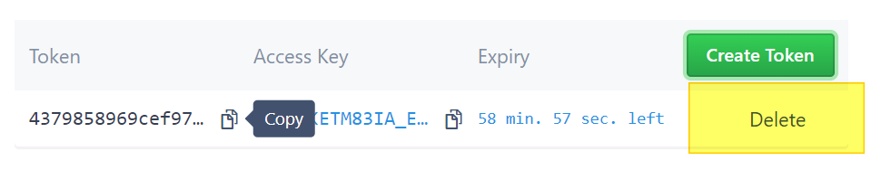

# Manage your Tokens
{:tools}

After create your very first [Endpoint](https://www.bitpaket.com/paket/api), yopu can now manage your tokens by reading this article.

{:toc}

## Create and Delete Tokens

Visit Manage > [Endpoints](https://www.bitpaket.com/paket/api) to see your endpoints.

Click **Show Tokens** as seen in above image.

### Create

When you click **Show Tokens** as stated above, click on **Tokens** and you will see this screen:

Click on **Create** and open this dialog:

If you prefer *expiration*, enable this feature and either give time **in seconds** (*like >= 3600*) or by **date**. Otherwise, this token will live forever.

When **success**, you will see below message:

Now, close this message box and your token list will be refreshed. You can copy your token and start using it.

> Note: While you can do many things with your token, some actions will require **Client Secret**. You can find this in **Credentials** tab.

### Delete

Open Token list and click **Delete* Link that you want to remove token. You will be asked if you are sure. Make sure this is what you want. After clicking yes, Your token will be deleted.

> Attention! There is no way back for this action. Please make sure that this token is not used on critical applications. All applications use this token will receive Authentication Failed message.
