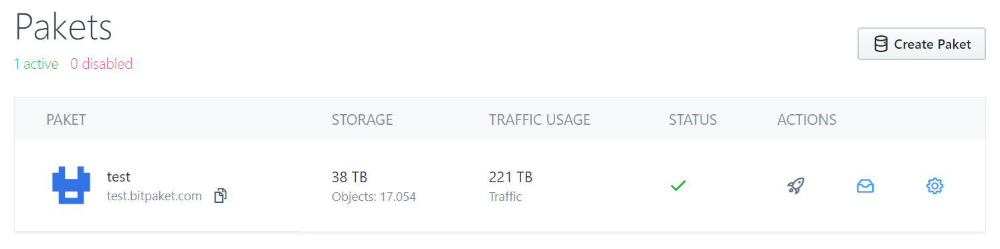
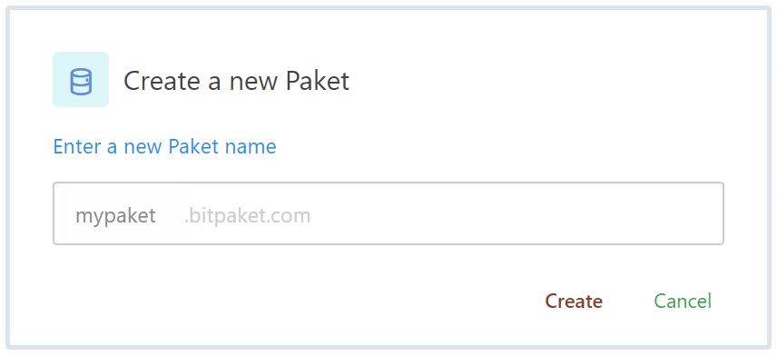

# Pakets
{:tools}

On BitPaket, Each **container** is a **paket**. Each paket can contain infinite numbers of objects and folders. Pakets can be disabled/enabled individually and has each paket its own subdomain (URI).

You also can use custom domains with your pakets. See below.

You can find paket under the *Manage*.

See your pakets: [https://www.bitpaket.com/pakets](https://www.bitpaket.com/pakets)

{:toc}

## Listing your Pakets

See your pakets by going Manage > [Pakets](https://www.bitpaket.com/pakets)

## Creating a Paket

Before create a paket we need to make sure about few things.

* You cannot create paket less than 5 chars.
* You cannot create paket contains invalid (unicode?) characters. Only lowercase, simple latin alphabet including dash (-) and numbers allowed.
* You cannot create some reserved words such as *admin, test, dev, ...*
* You cannot create already created paket name. Each paket name is a global identifier and can be already reserved by someone else

> **Attention!** There is a limit on how many pakets you may create per account. This limits vary based on your account type, location and other variables. When you reach that limit, paket creation will fail.

Create a new paket by going Manage > [Pakets](https://www.bitpaket.com/pakets)

