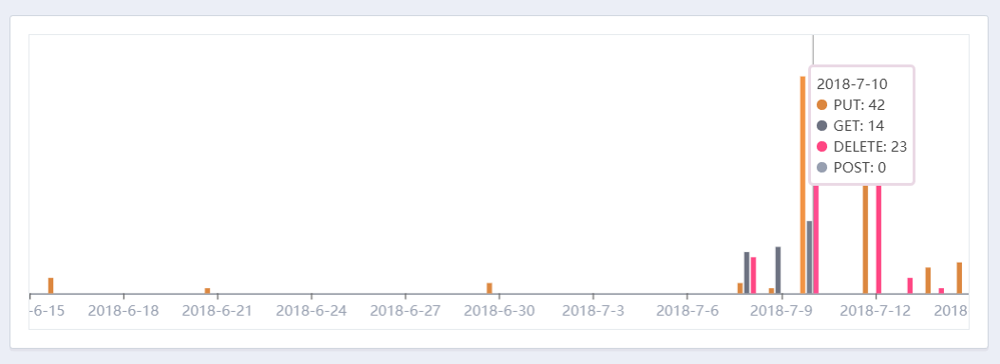
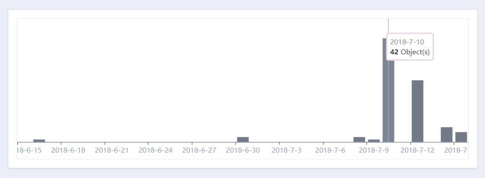
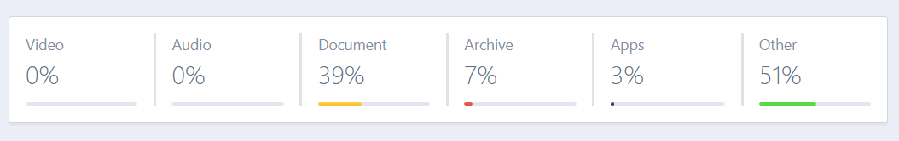

# Metrics
{:tools}

BitPaket not only gives you insights about your individual objects or pakets, It also provides simple but powerful metrics about how your environment used across globally.

From Speed meters to object insights, You'll love metrics.

See your metrics: [https://www.bitpaket.com/metrics](https://www.bitpaket.com/metrics)

{:toc}

## Download Speed

We, at BiştPakewt love to see our current speeds. Due to this we want to share same with you. As you can see our peeks, you also see your outbound speed. Whenever your obejcts downloaded, we start to gather metrics about it.

Below, you can see your current Transfer amount, speed and object counts.

We also have realtime speed graph.

> While you can see your download speed, you also see global peak in the background.

See your download speed: [https://www.bitpaket.com/metrics](https://www.bitpaket.com/metrics)

## Requests

To see GET, POST, PUT and DELETE requests, navigate below and you will see some insights about them.

See your object requests: [https://www.bitpaket.com/metrics](https://www.bitpaket.com/metrics)

## Objects

To see how many objects deployed day by day:

See your object statistics: [https://www.bitpaket.com/metrics](https://www.bitpaket.com/metrics)

## Object Types

We also provide a simple way of seeing how kind of objects deployed in your account.

See your object types: [https://www.bitpaket.com/metrics](https://www.bitpaket.com/metrics)